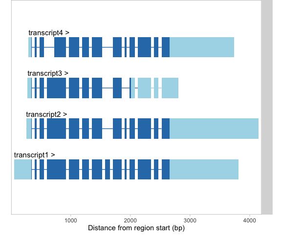

# pondeR

## Description

Nonsense-Mediated Decay (NMD) is an RNA surveillance mechanism which eliminates 
abberant messenger RNAs (mRNAs) harbouring a premature stop codon (PTC). pondeR
predicts the sensitivity of protein-coding mRNAs to NMD by scanning for NMD-inducing
features. Since pondeR takes GenomicRangesLists objects as input, it can analyze
mRNAs from any transcript annotation database or from high-throughput RNA-seq outputs.

## Installation
```r
# install.packages("devtools")
devtools::install_github("furhsham-h/ponder")
```

## Usage
pondeR is pre-loaded with GenomicRangesList objects containing sample
exon and cds ranges from 13 transcripts from a gene.
```r
library(pondeR)
names(query_exons)
#[1] "transcript1"  "transcript10" "transcript11" "transcript12" "transcript13" 
#[6] "transcript2"  "transcript3" "transcript4"  "transcript5"  "transcript6"  
#[11] "transcript7"  "transcript8"  "transcript9" 

names(query_cds)
#[1] "transcript1"  "transcript11" "transcript12" "transcript13" "transcript2"  
#[6] "transcript3"  "transcript4" "transcript9" 
```

Transcripts without cds information can be part of a GRangesList but will not
be analysed for NMD-inducing features. Transcript architecture of these 
transcripts can be visualized using _wiggleplotr_ package
```r
#if (!requireNamespace("BiocManager", quietly=TRUE))
#    install.packages("BiocManager")
#BiocManager::install("wiggleplotr")

library(wiggleplotr)
plotTranscripts(query_exons, query_cds)
```


Run predictNMD with exon and cds information as input
```r
predictNMD(query_exons, query_cds)
## A tibble: 2 x 6
#  tx          is_NMD dist_to_lastEJ num_of_down_EJs dist_to_downEJs threeUTRlength
#  <chr>       <lgl>           <int>           <dbl> <chr>                    <dbl>
#1 transcript3 TRUE              361               3 66,283,361                 502
#2 transcript4 TRUE              361               3 66,283,361                 474
```

